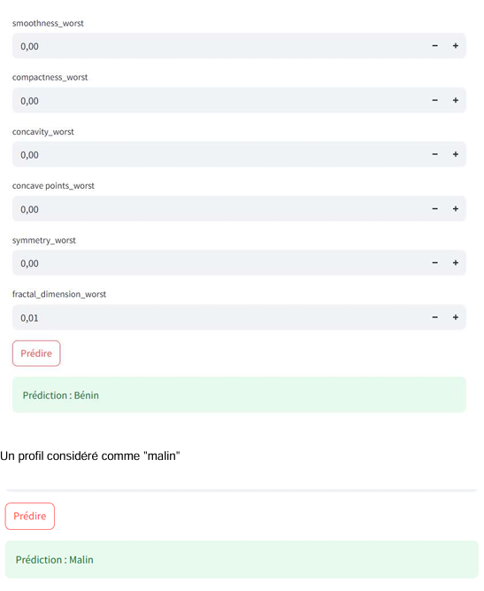
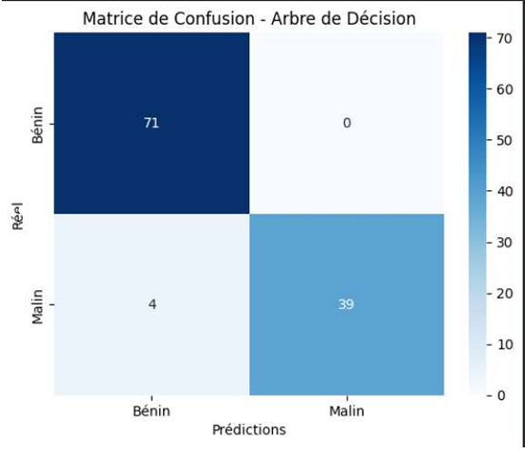

# 🎗️ Classification du Diagnostic du Cancer du Sein

Ce projet utilise le **Machine Learning** pour classifier les tumeurs mammaires comme étant **Bénignes** ou **Malignes** à partir de caractéristiques médicales.

## 📋 Description du Projet
L'objectif est de développer un modèle prédictif fiable pour aider au diagnostic précoce. Ce projet a été réalisé dans le cadre de mon module de **Machine Learning (S6)**.

## 🛠️ Technologies Utilisées
* **Langage :** Python
* **Bibliothèques :** Pandas, Scikit-learn, NumPy, Matplotlib/Seaborn
* **Interface :** Flask ou Streamlit 

## 📊 Jeu de Données
Le modèle est entraîné sur le dataset "Breast Cancer Wisconsin", comprenant des caractéristiques telles que :
* Le rayon de la tumeur
* La texture
* Le périmètre et l'aire
* La concavité

 ## 📊 Analyse des Résultats et Interface

### Interface de l'Application
L'application dispose d'une interface intuitive permettant une utilisation rapide :
* **Bouton « Prédire »** : Lance instantanément l'analyse via le modèle préchargé.
* **Retour Visuel** : Un message coloré s'affiche pour indiquer le diagnostic :
    * 🟢 **Bénin** 
    * 🔴 **Malin** 

### Performance du Modèle : Matrice de Confusion
La matrice de confusion nous permet d'évaluer la précision du modèle sur 114 cas de test :

**Analyse détaillée :**
* ✅ **71 cas bénins** ont été correctement classés.
* ✅ **39 cas malins** ont été correctement détectés.
* ❌ **4 cas malins** ont été faussement classés comme bénins (Faux Négatifs). 
> *Note : Dans un contexte médical, la réduction des faux négatifs est notre priorité absolue pour garantir la sécurité des patients.*

## 🚀 Comment l'utiliser
1. Cloner le projet : `git clone https://github.com/kanouz/Classification-du-Diagnostic-du-Cancer-du-Sein.git`
2. Installer les dépendances : `pip install -r requirements.txt` (si tu en as un)
3. Lancer l'application : `python app.py`
